# Smart-Healthcare-System

Web-based Smart Healthcare Management System

## Project Overview

The Smart Healthcare Management System is a web-based platform designed to digitally manage healthcare operations such as patient registration, appointment booking, doctor scheduling, and medical record management. The system replaces manual and fragmented hospital processes with a centralized, secure, and efficient digital solution.

## Problem It Solves

Healthcare institutions often face problems such as manual paperwork, long patient waiting times, poor record management, and lack of coordination between doctors and patients. Many existing software solutions are expensive or too complex for small clinics.

This project solves these problems by providing an affordable, easy-to-use, and centralized healthcare management platform.

## Target Users (Personas)

### Patient

- Book appointments online
- View medical history and reports
- Receive appointment reminders

### Doctor

- Manage availability schedules
- View patient medical records
- Update prescriptions and diagnosis

### Admin

- Manage users and system data
- Monitor appointments
- Generate reports and analytics

## Vision Statement

To build a secure, reliable, and user-friendly digital healthcare platform that improves patient experience, simplifies hospital operations, and enables efficient healthcare service delivery.

## Key Features / Goals

- Role-based authentication (Admin, Doctor, Patient)
- Online appointment booking and management
- Patient medical record management
- Doctor schedule management
- Dashboards for all user roles
- Search and filter functionality
- Secure data storage
- Optional email notifications

## Success Metrics

- At least 80% of users can use the system without external help
- Appointment booking response time below 5 seconds
- Zero unauthorized access incidents
- Accurate storage and retrieval of patient records
- System uptime above 95%

## Assumptions

- Users have internet access and web browsers
- Patients and doctors are willing to use digital platforms
- Clinics follow appointment-based workflows
- Development team has basic full-stack knowledge

## Constraints

- Project must be completed within 3 months
- Only free and open-source tools will be used
- Data privacy and security must be maintained
- UI must be simple and easy to use

## MoSCoW Prioritization

| Feature                        | Priority    |
| ------------------------------ | ----------- |
| User Registration & Login      | Must Have   |
| Appointment Booking System     | Must Have   |
| Patient Medical Records        | Must Have   |
| Doctor Schedule Management     | Must Have   |
| Admin User Management          | Must Have   |
| Email Notifications            | Should Have |
| Reports & Analytics            | Should Have |
| Upload Medical Reports         | Should Have |
| Dashboard Visual Analytics     | Could Have  |
| Hospital Department Management | Could Have  |
| Future AI Diagnosis Module     | Won't Have  |

---

## Branching Strategy (GitHub Flow)

This project follows the GitHub Flow branching strategy.

The main branch contains stable and production-ready code.

For implementing new features and improvements, separate feature branches are created.

### Example Feature Branch Used:

feature-full-auth-system

This branch was used to develop authentication and appointment management features before pushing changes to the main branch.

---

## Local Development Tools

The following tools were used during development:

- Node.js (Backend runtime)
- React.js (Frontend framework)
- MongoDB (Database)
- Docker Desktop (Containerization)
- Git and GitHub (Version control)
- Visual Studio Code (Code editor)

## Project Structure

```
smart-healthcare-system/
│
├── frontend/                         # React frontend application
│   ├── public/                       # Static assets
│   ├── src/                          # Source code
│   │   ├── components/               # Reusable UI components
│   │   ├── pages/                    # Page-level components (Dashboard, Login, etc.)
│   │   ├── services/                 # API service calls
│   │   ├── context/                  # Authentication & global state management
│   │   └── App.js                    # Main React entry
│   └── package.json
│
├── backend/                          # Express backend server
│   ├── routes/                       # API route definitions
│   ├── controllers/                  # Business logic
│   ├── models/                       # Mongoose database schemas
│   ├── middleware/                   # JWT authentication & authorization
│   ├── config/                       # Database configuration
│   ├── server.js                     # Main server entry point
│   └── package.json
│
├── docs/
│   └── design/                       # Architecture diagrams & UI screenshots
│       ├── architecture.drawio
│       ├── architecture.png
│       ├── login.png
│       ├── patient-dashboard.png
│       ├── doctor-dashboard.png
│       ├── admin-dashboard.png
│       └── ...
│
├── docker-compose.yml                # Docker container configuration
├── README.md                         # Project documentation
└── .env                              # Environment variables (not committed)
```

---

## Quick Start – Local Development (Docker)

## Deployment

The Smart Healthcare Management System is containerized using Docker to ensure consistent development and deployment environments. Docker Compose is used to orchestrate multiple services including the frontend, backend, and MongoDB database.

### Deployment Architecture

- Frontend Container – Hosts the React application
- Backend Container – Runs the Express.js REST API server
- Database Container – MongoDB instance for persistent data storage

All services communicate through an internal Docker network, ensuring secure and isolated inter-service communication.

### Environment Configuration

Environment variables such as database URI, JWT secret, and server ports are managed using a `.env` file to maintain security and flexibility across different deployment environments.

### Scalability & Cloud Readiness

The containerized architecture makes the system cloud-ready and easily deployable on platforms such as AWS, Azure, or Google Cloud. Services can be scaled independently based on load requirements.

This deployment approach ensures portability, maintainability, and simplified DevOps management.

### Prerequisites

Make sure the following software is installed:

- Docker Desktop

---

### Steps To Run The Project

1. Clone the repository:

```bash
git clone https://github.com/avinabsingh/smart-healthcare-system.git
```

### Architecture Diagram

docs/design/architecture.png

### Updated Figma Screens

docs/design/

### Old Figma WireFrames

docs/wireframes_DA1/


## Software Design

### Design Philosophy (Summary)

The Smart Healthcare Management System was designed with long-term maintainability, scalability, and clear separation of responsibilities in mind. A layered Client–Server architecture combined with the MVC pattern was selected to minimize tight coupling between components and allow independent development of frontend, backend, and database layers.

Security and modularity were treated as core design priorities rather than afterthoughts. JWT-based authentication and role-based access control (RBAC) ensure secure and stateless user management, while Docker containerization guarantees consistent deployment environments and future cloud readiness.

This architectural approach enables easier debugging, feature expansion, and integration of future modules such as analytics dashboards, mobile applications, or third-party healthcare systems.

---

### System Architecture
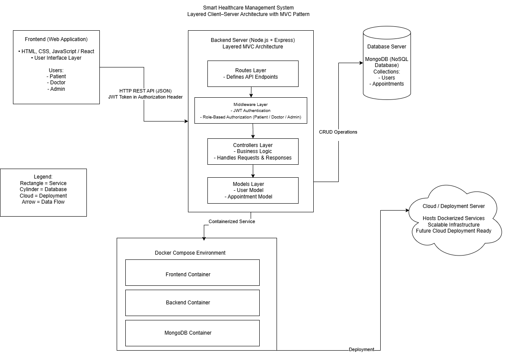

The system follows a Layered Client–Server architecture combined with the MVC pattern to enforce clear separation between the presentation, business logic, and data layers. This structure minimizes tight coupling between components, improving maintainability and enabling independent development of frontend and backend modules. JWT-based authentication and role-based access control (RBAC) were implemented to ensure secure, stateless, and scalable user management for Patients, Doctors, and Admins. Additionally, Docker containerization and modular backend structuring were adopted to maintain environment consistency, simplify deployment, and support future scalability and cloud integration.

### Technology Stack Overview

- Frontend: React.js (UI rendering and client-side routing)
- Backend: Node.js + Express.js (REST API and business logic)
- Database: MongoDB with Mongoose ORM
- Authentication: JWT + bcrypt password hashing
- Containerization: Docker & Docker Compose

### API Structure (High-Level)

The backend exposes RESTful APIs organized by feature modules:

- /api/auth → Registration & Login
- /api/appointments → Booking and management
- /api/users → User management
- /api/records → Medical records upload & retrieval

All protected routes require JWT authentication.
---

## UI/UX Design (Figma Screens)

The user interface was initially designed as low-fidelity wireframes and later refined into structured, high-fidelity Figma screens. The system follows a role-based dashboard design to ensure clarity, usability, and efficient healthcare workflow management.

### User Registration Screen


### Login Screen  


### Patient Dashboard
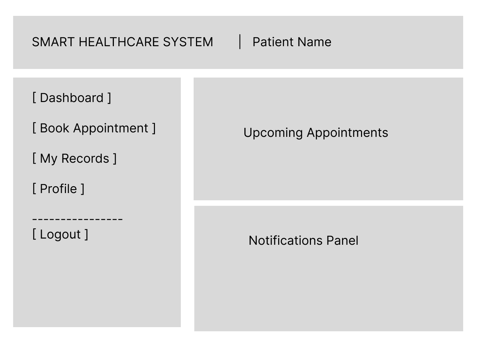

### Doctor Dashboard
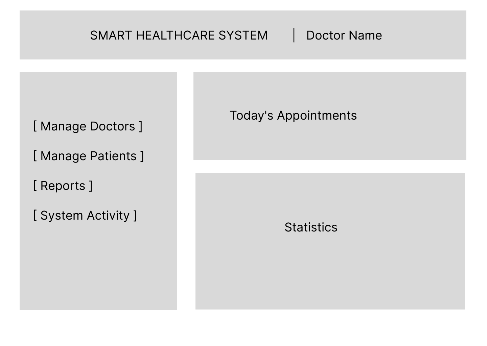

### My Appointments Screen
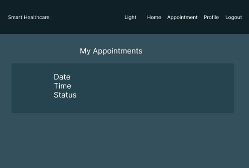

<p>
  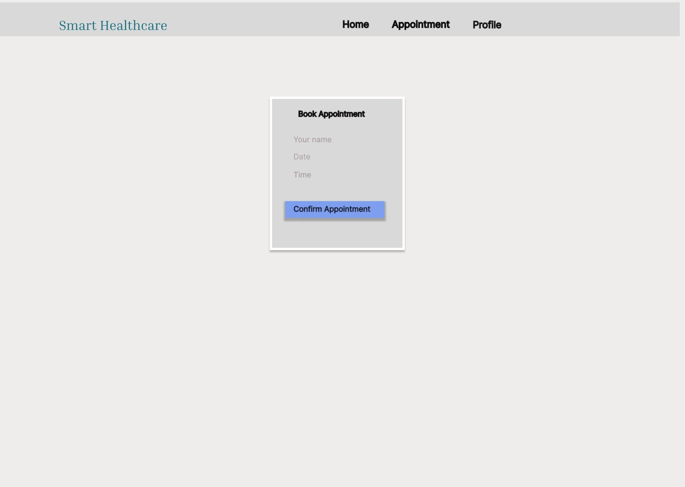
</p>

### Medical Records Interface
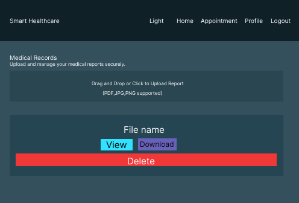

---

### Design Highlights

- **Role-Based Interface:** Separate dashboards for Patient and Doctor with task-specific features.
- **Consistent Navigation Bar:** Uniform top navigation for smooth user flow.
- **Card-Based Layout:** Action buttons and features are organized in structured cards.
- **Calendar-Based Scheduling:** Visual date selection for appointment management.
- **Clear Typography Hierarchy:** Improved readability using structured headings and section labels.
- **Consistent Color Theme:** Healthcare-themed dark UI for visual consistency.
- **User-Centric Design:** Interfaces designed to minimize complexity and improve accessibility.

The UI focuses on simplicity, intuitive navigation, and efficient interaction between patients and healthcare providers.

---

### Implemented Web Application Screenshots

#### User Registration
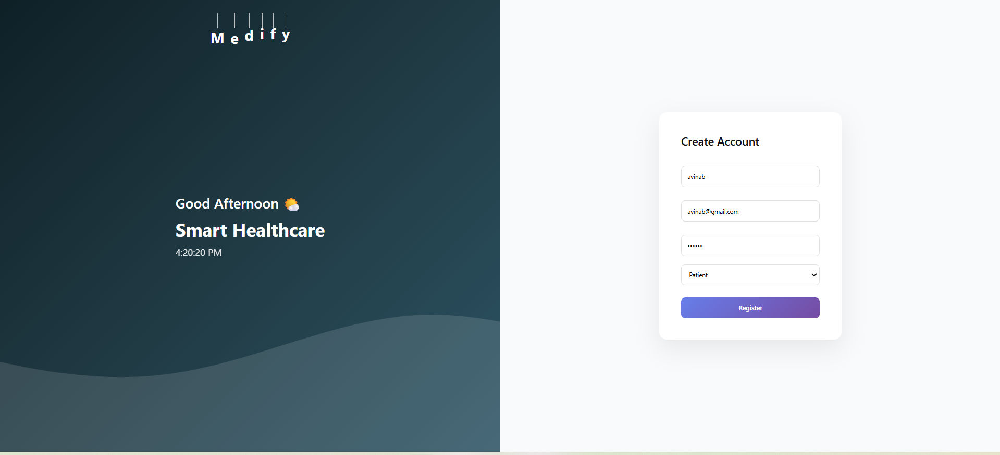

This screen allows new users (Patients or Doctors) to create an account by providing essential details such as name, email, password, and role selection. Passwords are securely hashed using bcrypt before storage, and validation mechanisms ensure data integrity during registration.

---

#### Patient Dashboard
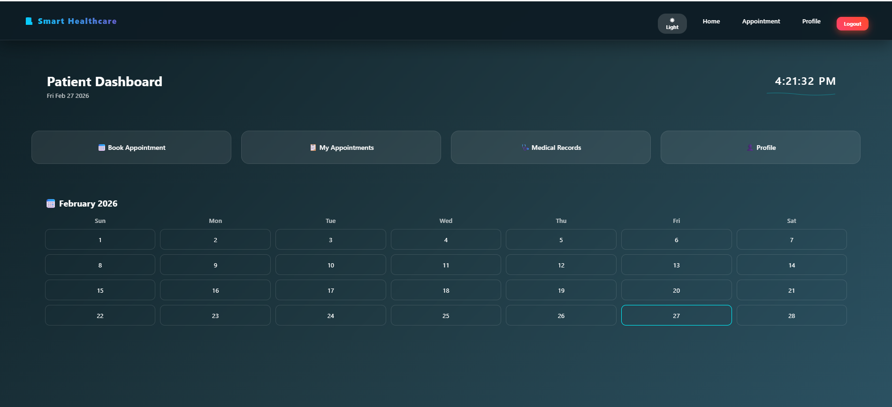

The Patient Dashboard provides an overview of booked appointments, medical history, and profile details. Patients can schedule new appointments, upload medical records, and track upcoming consultations in an intuitive and user-friendly interface.

---

#### Doctor Dashboard
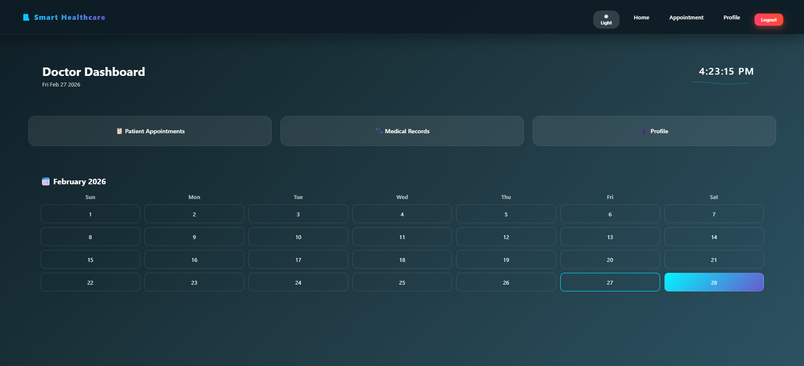

The Doctor Dashboard enables doctors to view scheduled appointments, access patient medical records, and manage their availability. Role-based authorization ensures doctors can only access assigned patient data, maintaining privacy and security.

---

#### Appointment Booking
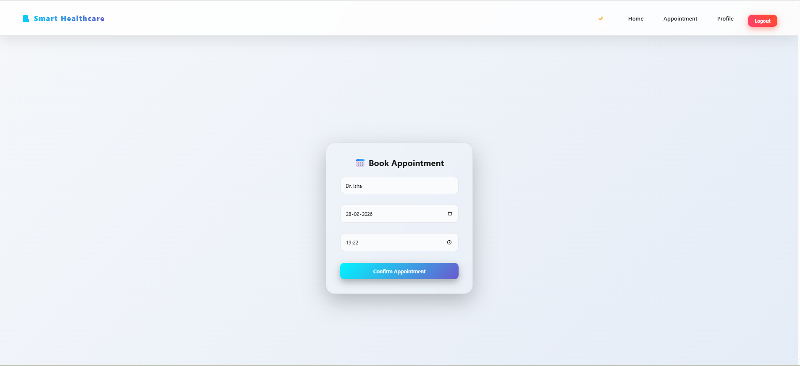

This interface allows patients to select available doctors, choose preferred dates and time slots, and confirm appointments. The booking system communicates with the backend via REST APIs to store and retrieve appointment data securely.

---

#### Medical Record Upload
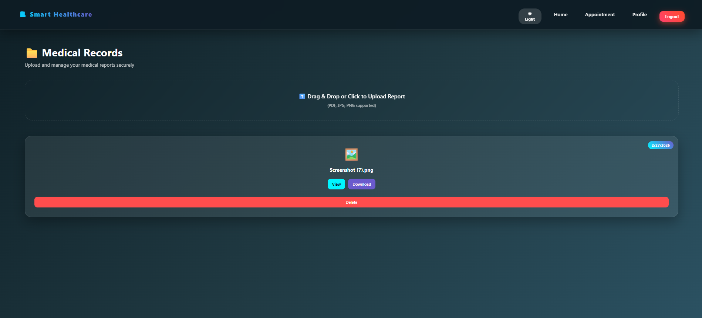

This module allows patients to upload medical reports and documents, which are securely stored and accessible only to authorized doctors. File validation and authentication middleware ensure secure handling of sensitive healthcare information.
